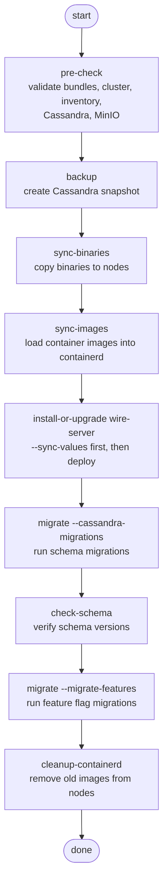
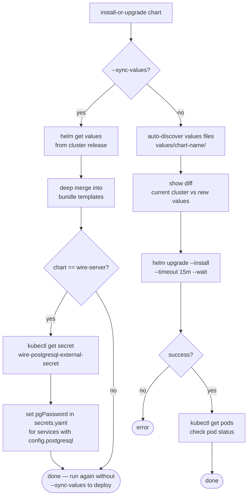
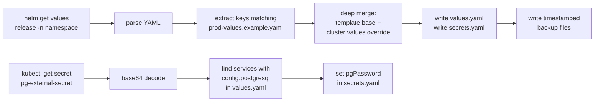
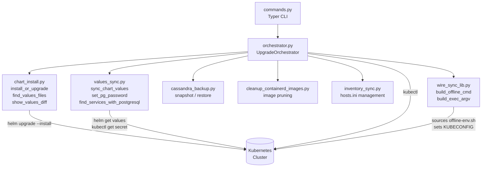

# Wire Upgrade CLI

Command-line tool for performing Wire Server upgrade actions. It wraps
helm/kubectl calls and helper scripts packaged with the project.

---

## Installation

Build a wheel and install it into the Python environment you intend to use:

```sh
cd /path/to/wire-upgrade-tool
python3 -m build               # produces dist/wire_upgrade-*.whl
pip install --force-reinstall dist/wire_upgrade-*.whl
```

You can `scp` the wheel to another host and install it there with
`pip install /path/to/wheel` (use `--user` as appropriate).

The wheel bundles all Python modules and declares the runtime dependencies
(`typer`, `rich`, `pydantic`, `PyYAML`), so nothing else is required.

---

## Configuration

The CLI reads options from a JSON config file named `upgrade-config.json`.
`wire-upgrade init-config` will create a template:

```json
{
  "new_bundle": "/home/demo/new",
  "old_bundle": "/home/demo/wire-server-deploy",
  "kubeconfig": null,
  "log_dir": "/var/log/upgrade-orchestrator",
  "tools_dir": null,
  "admin_host": "localhost",
  "dry_run": false,
  "snapshot_name": null
}
```

Any field may be overridden on the command line. `kubeconfig` must point to an
existing file — there is no fallback to `~/.kube/config`. `tools_dir` defaults
to the installed package directory.

Command-line flags take precedence over the config file.

---

## Commands

All commands support `-n/--namespace` when they talk to a namespaced resource;
the default is `default`.

### init-config
Generate a new `upgrade-config.json` template:

```sh
wire-upgrade init-config --kubeconfig /path/to/kubeconfig \
    --new-bundle /home/demo/new --old-bundle /home/demo/old
```

### status
Display cluster node/pod status and all Helm release information.

```sh
wire-upgrade status
wire-upgrade status -n prod
```

### pre-check
Run pre-upgrade sanity checks: cluster connectivity, inventory diff, Cassandra
reachability, and MinIO connectivity.

### sync / sync-binaries / sync-images
Copy binaries and/or container images from the new bundle to the host.

```sh
wire-upgrade sync                # binaries + images
wire-upgrade sync-binaries       # binaries only
wire-upgrade sync-images         # images only
wire-upgrade sync --dry-run
```

### backup
Cassandra snapshot management.

```sh
wire-upgrade backup                                   # create snapshot
wire-upgrade backup --list-snapshots
wire-upgrade backup --restore --snapshot-name <name>
wire-upgrade backup --archive-snapshots --snapshot-name <name>
```

See `wire-upgrade backup --help` for the full option list.

### migrate
Run Cassandra schema migrations and/or the migrate-features chart. At least one
flag must be provided:

```sh
wire-upgrade migrate --cassandra-migrations -n prod
wire-upgrade migrate --migrate-features -n prod
wire-upgrade migrate --cassandra-migrations --migrate-features -n prod
```

`--cassandra-migrations` deploys the `cassandra-migrations` chart and polls
until the migration job completes. `--migrate-features` deploys the
`migrate-features` chart. Both support `--dry-run`.

### check-schema
Compare live Cassandra schema metadata against the expected versions from the
bundle's chart:

```sh
wire-upgrade check-schema
wire-upgrade check-schema -n prod
```

### install-or-upgrade
Deploy or upgrade a Helm chart.

```sh
# wire-server (default when no chart is given)
wire-upgrade install-or-upgrade
wire-upgrade install-or-upgrade wire-server -n prod

# Sync live cluster values into the bundle templates first, then deploy
wire-upgrade install-or-upgrade wire-server --sync-values

# Custom chart — looks for chart at charts/{name} and values at values/{name}/
wire-upgrade install-or-upgrade wire-utility
wire-upgrade install-or-upgrade wire-utility --release my-release

# Override chart path or values files explicitly
wire-upgrade install-or-upgrade wire-utility --chart charts/wire-utility \
    --values /home/demo/new/values/wire-server/values.yaml \
    --values /home/demo/new/values/wire-server/secrets.yaml

# Reuse existing release values (skips values file lookup)
wire-upgrade install-or-upgrade wire-server --reuse-values

# Dry-run (shows diff + helm --dry-run output, no actual deployment)
wire-upgrade install-or-upgrade wire-server --dry-run
```

**Values auto-discovery:** for each chart, the tool looks for values files under
`values/{chart-name}/` in the bundle (preferring `values.yaml` / `secrets.yaml`
over `prod-values.example.yaml` / `prod-secrets.example.yaml`). Pass `--values`
explicitly to override.

**`--sync-values`:** fetches live helm values from the cluster, merges them into
the bundle templates, and writes `values.yaml` / `secrets.yaml`. For
`wire-server` it also syncs the PostgreSQL password from the cluster secret.
This flag syncs only — it does not deploy. Run `install-or-upgrade` again
without the flag to deploy.

### cleanup-containerd / cleanup-containerd-all
Remove unused container images from containerd on one or all nodes.

```sh
wire-upgrade cleanup-containerd --dry-run          # preview (default)
wire-upgrade cleanup-containerd --apply            # actually remove
wire-upgrade cleanup-containerd --apply --sudo     # needed if containerd socket requires root
wire-upgrade cleanup-containerd-all                # run --apply across all kube nodes
```

### inventory-sync / inventory-validate
Generate and validate the Ansible inventory for the new bundle.

```sh
wire-upgrade inventory-sync      # copy and adapt hosts.ini from old bundle
wire-upgrade inventory-validate  # check required groups and variables
```

### assets-compare
Compare asset indices between the bundle and a remote assethost.

---

## System Design

### Full Upgrade Sequence

The recommended order of operations for a Wire Server upgrade:



---

### install-or-upgrade Flow



---

### Values Sync Detail (--sync-values)



---

### Component Architecture



---

## How it works

Before running any upgrade command, the new Wire Server release bundle must be
copied to the admin host (e.g. `hetzner3`) and its path set as `new_bundle` in
`upgrade-config.json`. The bundle is a directory that contains the Helm charts,
Ansible playbooks, container images, and the `bin/offline-env.sh` script that
configures the offline environment. Every command sources that script before
invoking `helm`, `kubectl`, or `ansible-playbook`, so the bundle must be present
and intact on the host before the tool is used.

`UpgradeOrchestrator` encapsulates configuration and provides one method per
command. Kubernetes and Helm calls go through `run_kubectl()`, which sources
`offline-env.sh` from the new bundle and optionally sets `KUBECONFIG` before
invoking the command. All subprocesses return `(rc, stdout, stderr)` tuples.

Chart installation logic lives in `wire_upgrade/chart_install.py`. Values
sync logic lives in `wire_upgrade/values_sync.py`. The CLI command registration
is in `wire_upgrade/commands.py`.

---

## Development

1. Create a venv: `python3 -m venv .venv && source .venv/bin/activate`
2. Build: `python3 -m build`
3. Install: `pip install --force-reinstall dist/wire_upgrade-*.whl`
4. Deploy to test host: `scp dist/*.whl user@host:/tmp/ && ssh user@host pip install --force-reinstall /tmp/*.whl`

Run `wire-upgrade COMMAND --help` for detailed option lists.
